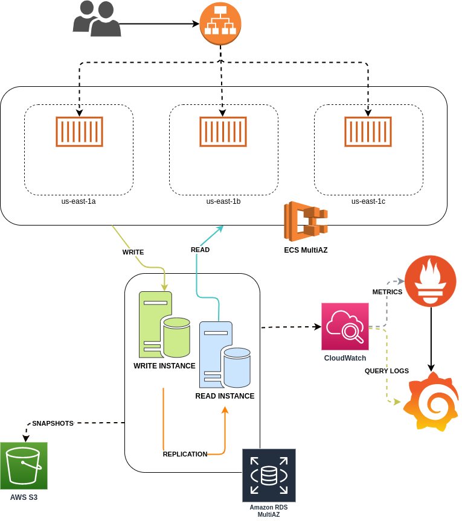
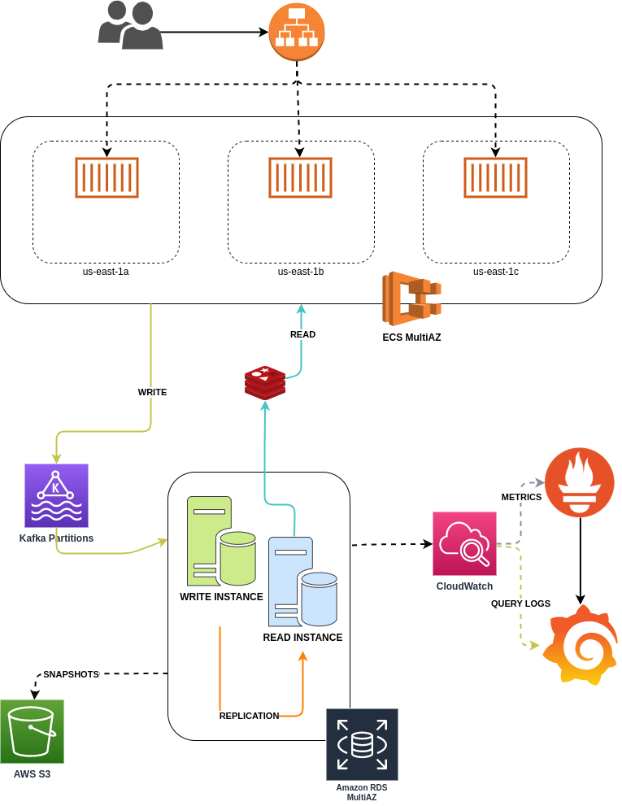

# Operations Engineer Task - Theoretical part - Júlio Ballot

## The problem

Imagine that for providing data to fuel this service, you need to receive and insert big batches of new prices, ranging within tens of thousands of items, conforming to a similar format. Each batch of items needs to be processed together, either all items go in, or none of them does.

Both the incoming data updates and requests for data can be highly sporadic - there might be large periods without much activity, followed by periods of heavy activity.

High availability is a strict requirement from the customers.

- How would you design the system?
- How would you set up monitoring to identify bottlenecks as the load grows?
- How can those bottlenecks be addressed in the future?

Provide a high-level diagram, along with a paragraphs describing the choices you've made and what factors do you need to take into consideration.

### Additional questions
Here are a few possible scenarios where the system requirements change or the new functionality is required:

1. The batch updates have started to become very large, but the requirements for their processing time are strict.

2. Code updates need to be pushed out frequently. This needs to be done without the risk of stopping a data update already being processed, nor a data response being lost.

3. For development and staging purposes, you need to start up a number of scaled-down versions of the system.

Please address at least one of the situations. Please describe:

- Which parts of the system are the bottlenecks or problems that might make it incompatible with the new requirements?
- How would you restructure and scale the system to address those?

## Solution

Starting with the necessity of running the whole architecture in a High Availability environment I would first migrate  the ECS and RDS plataforma to a MultiAZ configuration. So that I could scale the containers and distribute, having at least one copy of the application in each zone of my region, as depicted bellow:

With this practice all requests are going through the ALB and distributed among the containers in each zone. This would solve the problem of having a container available to respond requests, one small increment if using session would separate it from the application by having a key-value storage systems, like Redis or Memcached.

Because this application has risks of have a read intensive workload we could use some read instance of our RDS replicated database solution. Organizing the read and directing it to be done on a secondary machine will reduce the concurrency for disk manipulation in the Master node. If this reading behavior become more intensive a cache maybe needed, where the most requested queries could be kept in cache for quickly answers a query or request.

At this moment this solution could deal with most of the cases, but the writing process could have some troubles. With a single point of writing we could easily overwhelm the database and be at risk of loosing data. A better approach would be having a intermediate process like a broker to deal it the delivery of all process in a way that we could process or structure  to deal with the high load of inputted information. In this case a broker could do the trick, using a Message Queuer that would receive the information and have the database, as a consumer, reading all the events that needs to be stored. The advantage here would be having a solution that could allow the partitioning of events in a ordered way scaled across multiples machines.

Moving to the monitoring part I would use a combination of CloudWatch, Prometheus and Grafana. CloudWatch would give the logs and metric flow that is needed for prometheus and grafana where I would have a centralized dashboard with metrics that allows me to get inside information about the performance of the database solution. Metrics like CPU, DISK and Network utilization are useful in order to understand how this systems behave in different circumstances (high volume, throughput, etc), and the queries log would allow me to identify why queries are slow and by that need to create a index for example.
